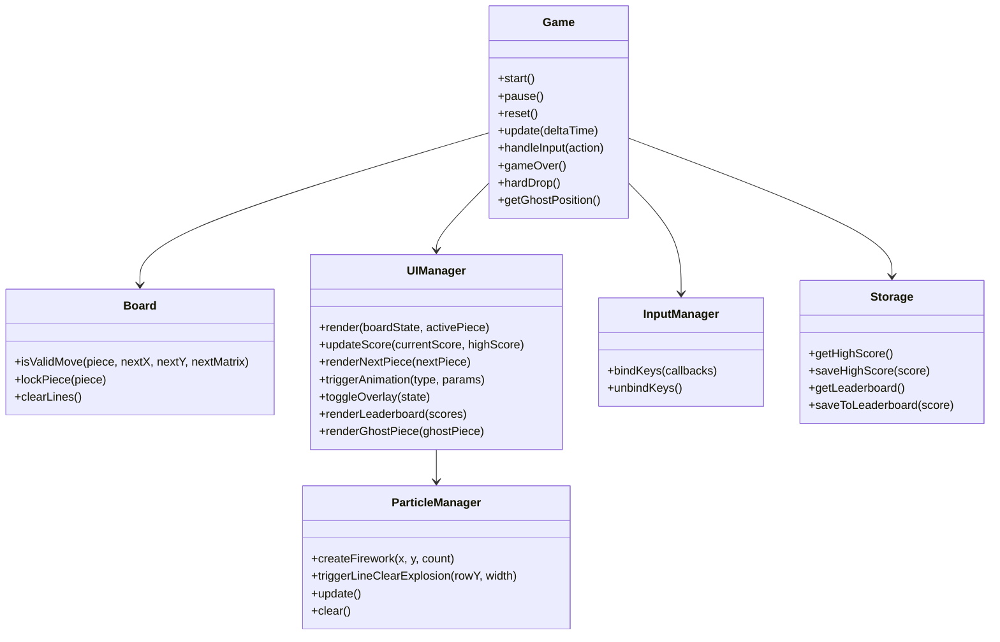
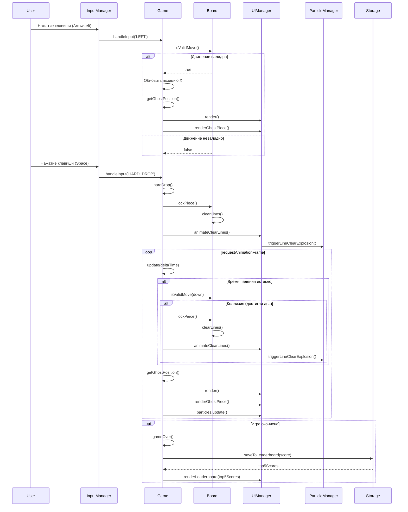

# System Design Document

## Implementation approach
Приложение следует паттерну **Game Loop** (для цикла обновления/рендеринга) и **MVC (Model-View-Controller)** для разделения логики и интерфейса.
Вся реализация выполнена на Vanilla JavaScript и CSS3, без сторонних библиотек. Для микро-анимаций используется CSS-транзиции, а для основного физического цикла — `requestAnimationFrame`.
Проект разделен на директории `src/` для исходного кода и `tests/` для модульного тестирования.

## Python package name
tetris_totoro_web

## File list
```text
projects/tetris/
├── docs/
│   ├── PRD.md
│   └── System_Design.md
├── src/
│   ├── index.html
│   ├── css/
│   │   ├── style.css
│   │   └── animations.css
│   └── js/
│       ├── main.js
│       ├── Game.js
│       ├── Board.js
│       ├── Tetromino.js
│       ├── InputManager.js
│       ├── UIManager.js
│       ├── ParticleManager.js
│       ├── Storage.js
│       └── constants.js
└── tests/
    ├── Board.test.js
    ├── Tetromino.test.js
    └── Game.test.js
```

## Data structures and interface definitions

```javascript
export class ParticleManager {
    constructor(container)
    createFirework(x, y, count = 25)
    triggerLineClearExplosion(rowY, width)
    update()
    clear()
}
```



## Program call flow


## Anything UNCLEAR
Все требования согласованы с PRD.md. Модуль ParticleManager изолирован и интегрируется через UIManager.
