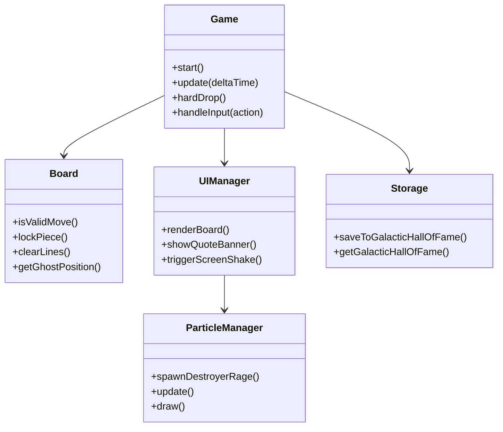
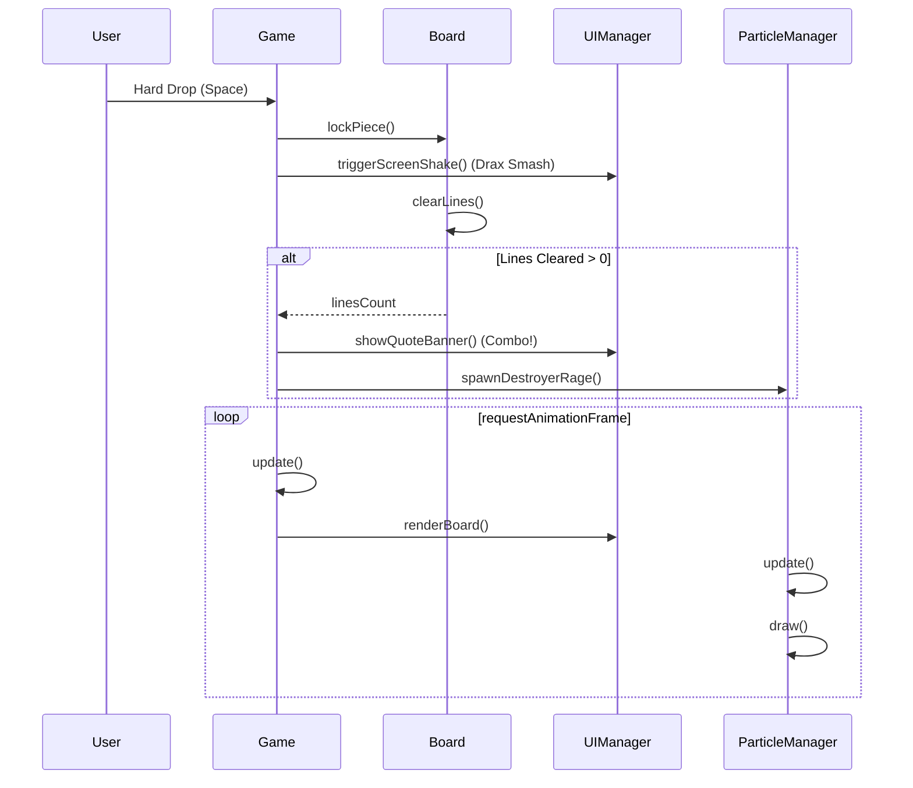

# System Design Document

## Implementation Approach & Design System
Приложение следует паттернам Game Loop и MVC (Model-View-Controller). 
Реализация выполняется на Vanilla JavaScript, HTML5 Canvas API и CSS3 (без сторонних фреймворков и библиотек) в эстетике «Стражей Галактики» (Drax the Destroyer Edition).

**Design System Tokens (CSS Custom Properties):**
- Титановый сланец (Titanium Slate): `#121816` (фоны)
- Броня Дракса (Drax Armor): `#24332c` (акценты)
- Неоновый кармин (Rage Carmine): `#ff1a40` (татуировки-рубцы, эффекты ярости)
- Золото «Милано» (Milano Gold): `#ffb830` (HUD-индикаторы)
- Звездный циан (Stellar Cyan): `#00e5ff` (Ghost Piece, интерфейс)

**Кокпит звездолета «Милано»:**
- Интерфейс оформляется скошенными рамками под углом 45 градусов. Реализуется через `clip-path: polygon(...)`.
- Неоновые швы и подсветка краев через `box-shadow` и CSS-фильтры.

**Juice & Effects:**
- **Физика частиц ярости Разрушителя (`ParticleManager`)**: При уничтожении линий спавнится от 35 до 50 частиц. Частицы включают карминовые искры, титановые осколки с вращением (`vRot`), и плазменные вспышки. Реализуется импульс, гравитация, затухание (fade-out) частиц.
- **Боевые цитаты Дракса (`UIManager.showQuoteBanner`)**: Всплывающий стилизованный текст при успешных комбо.
- **Тактильный Screen Shake (`UIManager.triggerScreenShake`)**: При Hard Drop («Drax Smash») происходит сотрясение экрана для передачи сокрушительной мощи удара.

## Data Structures & Interface Definitions

**constants.js**
Хранит общие конфигурации, палитру Дракса, определения тетромино (матрицы и цвета) и массив боевых цитат Дракса («I AM A WARRIOR!», «NOTHING GOES OVER MY HEAD!», «DESTROY!» и др.).

**ParticleManager.js**
```javascript
export class ParticleManager {
    constructor(ctx) // Canvas 2D context
    spawnDestroyerRage(x, y, count) // Спавн 35-50 частиц
    update(deltaTime) // Физика: гравитация, вращение, затухание
    draw() // Рендеринг карминовых искр и осколков
    clear()
}
```

**UIManager.js**
```javascript
export class UIManager {
    constructor(canvas, uiContainer)
    renderBoard(boardState, activePiece)
    renderGhostPiece(ghostPiece)
    renderNextPiece(nextPiece)
    updateScoreBoard(score, level, lines)
    showQuoteBanner(quote) // Боевые цитаты Дракса
    triggerScreenShake() // Тактильный Drax Smash shake
    showLeaderboard(scores)
}
```

**Game.js**
```javascript
export class Game {
    start()
    update(deltaTime) // Game Loop
    hardDrop() // Мгновенный сброс, триггерит Drax Smash
    handleInput(action)
    calculateCombo()
    gameOver()
}
```

**Board.js**
```javascript
export class Board {
    constructor(width, height)
    isValidMove(piece, x, y, matrix)
    lockPiece(piece)
    clearLines() // Возвращает количество сгоревших линий
    getGhostPosition(piece)
}
```

**Tetromino.js**
```javascript
export class Tetromino {
    constructor(type)
    rotate()
    getMatrix()
    getColor()
}
```

**Storage.js**
```javascript
export class Storage {
    saveToGalacticHallOfFame(scoreData)
    getGalacticHallOfFame() // Возвращает Топ-5
}
```

## Architecture Diagrams

**Class Diagram**


**Sequence Diagram**


## Strict File List

- `src/index.html`: Точка входа, структура кокпита «Милано» (HTML5).
- `src/css/style.css`: Глобальные стили, CSS токены (переменные), структура кокпита (`clip-path`).
- `src/css/animations.css`: CSS-анимации (Screen Shake, всплывающие цитаты, неоновые пульсации).
- `src/js/main.js`: Инициализация компонентов, настройка Game Loop (requestAnimationFrame).
- `src/js/Game.js`: Главный контроллер, логика игры, тайминги.
- `src/js/Board.js`: Модель игрового поля (матрица 10x20), коллизии, очистка линий.
- `src/js/Tetromino.js`: Класс фигуры (SRS вращение, цвета, позиция).
- `src/js/InputManager.js`: Обработка клавиатуры (стрелки, WASD, пробел).
- `src/js/UIManager.js`: Визуализация (Canvas 2D), HUD, вызовы эффектов (цитаты, shake).
- `src/js/ParticleManager.js`: Модуль процедурных частиц ярости Разрушителя.
- `src/js/Storage.js`: Работа с LocalStorage (Galactic Hall of Fame).
- `src/js/constants.js`: Конфигурация игры (цвета, матрицы фигур, цитаты).
- `tests/Board.test.js`: Unit-тесты для логики стакана и коллизий.
- `tests/Tetromino.test.js`: Unit-тесты для матриц вращения (SRS).
- `tests/Game.test.js`: Unit-тесты для очков, уровней и общего флоу.

## Architectural Decision Records (ADR)

**ADR-001: Pure DOM/Canvas Particles без тяжелых WebGL библиотек**
- **Контекст:** Требуется реализовать кинематографические эффекты ярости Дракса.
- **Решение:** Использовать нативный `CanvasRenderingContext2D` для генерации 35-50 частиц на каждое сгорание линии. Отказаться от Three.js/Pixi.js.
- **Обоснование:** Производительности 2D-канваса с запасом хватает для отрисовки до 500 частиц со свойствами вращения и альфа-затухания, при этом не раздувается размер проекта.

**ADR-002: Полигональные рамки через 45° clip-path**
- **Контекст:** Нужно создать футуристичный HUD-интерфейс кокпита «Милано» со скошенными углами.
- **Решение:** Применить CSS-свойство `clip-path: polygon(...)` для контейнеров, плюс `drop-shadow` фильтры для неоновых швов (так как `box-shadow` обрезается `clip-path`).
- **Обоснование:** Это позволяет создавать адаптивные и математически точные sci-fi рамки любой сложности без необходимости верстать SVG-контейнеры.
